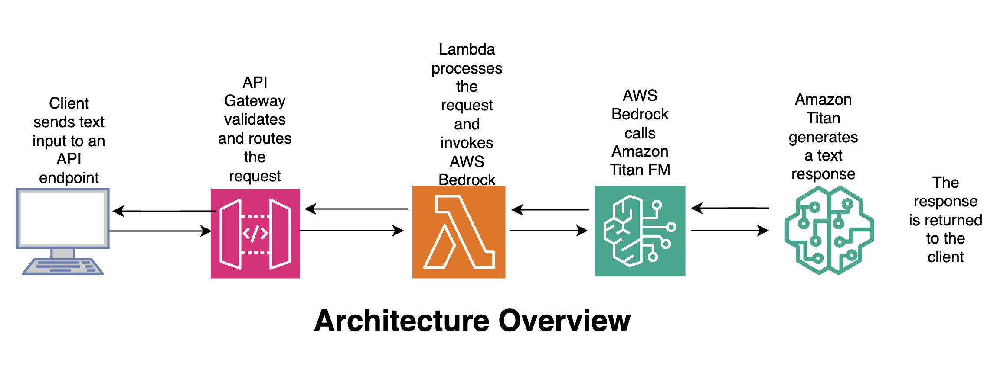
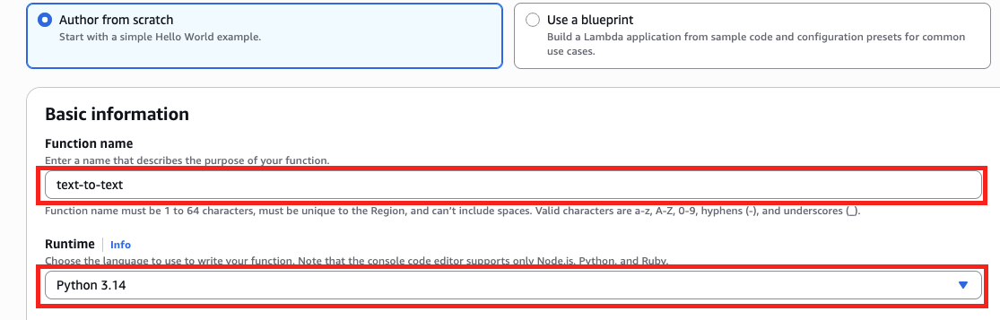
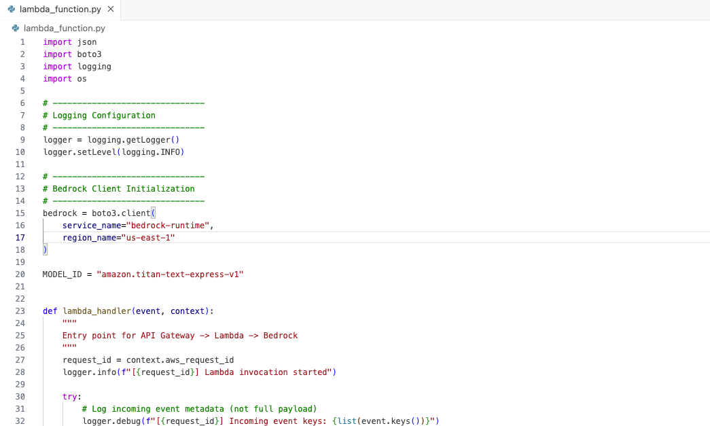
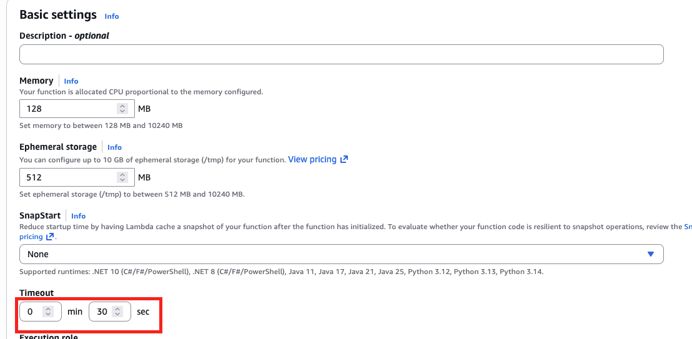
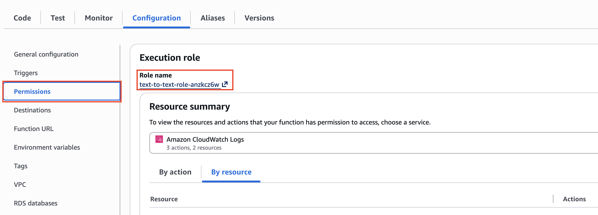
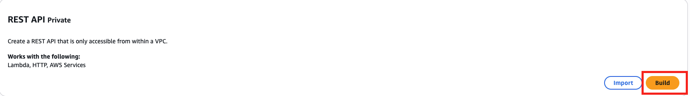
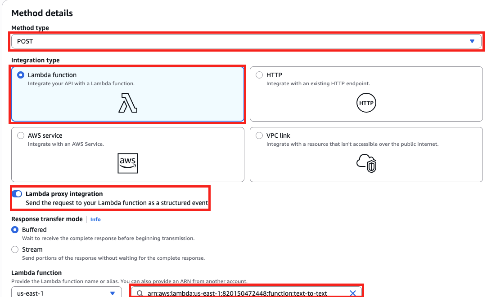
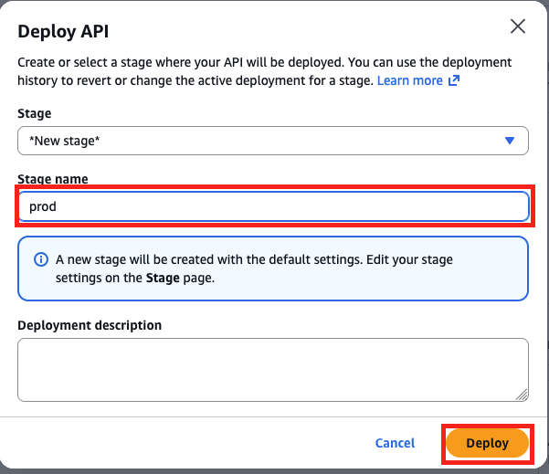

 ## Building a Production-Ready Text-to-Text API with AWS Bedrock, Lambda & API Gateway
### Project Overview

This project demonstrates how to design and deploy a production-ready text-to-text AI API using AWS Bedrock and Amazon Titan Text, exposed securely via Amazon API Gateway and powered by AWS Lambda.

The goal is to show how organizations can integrate Generative AI capabilities into real business systems while maintaining security, scalability, cost control, and observability.


### Business Use Case
Many organizations want to leverage Generative AI for:
1. Internal copilots
2. Automated content generation
3. Text summarization
4. Data explanations
5. Customer support automation

However, directly exposing foundation models to applications can introduce security, cost, and governance risks.

This project solves that by:
Abstracting the foundation model behind a controlled API
Enforcing consistent prompts and parameters
Centralizing access, logging, and cost management
The result is a secure AI service layer that can be reused across multiple teams and applications.

## Architecture Overview



### Flow:

1. Client sends text input to an API endpoint

2. API Gateway validates and routes the request

3. Lambda processes the request and invokes AWS Bedrock

4. Amazon Titan generates a text response

The response is returned to the client

### 🛠️ Tools & Services Used
#### 🔹 AWS Bedrock

Fully managed service for accessing foundation models

No infrastructure to manage

Enterprise-grade security

Pay-per-use pricing

#### 🔹 Amazon Titan Text (amazon.titan-text-express-v1)

Fast, cost-efficient text generation model

Ideal for text-to-text use cases

Deterministic behavior with low temperature

Designed for enterprise workloads

#### 🔹 AWS Lambda

Serverless compute for business logic

Handles request validation and AI invocation

Scales automatically

#### 🔹 Amazon API Gateway

Securely exposes the AI service as a REST API

Enables authentication, throttling, and monitoring

Acts as the public interface for applications

#### 🔹 Python (Boto3)

AWS SDK for invoking Bedrock

Lightweight and production-friendly

#### 🧠 Why This Design Matters

Stateless AI calls: Foundation models do not retain memory

Explicit control: Prompts and parameters are centrally managed

Security-first: IAM-controlled access to Bedrock

Cost management: Token limits and model choice enforced

Reusability: Multiple applications can consume the same API

This mirrors how AI platforms are built in regulated and enterprise environments.

#### 🧩 AWS Lambda: Text-to-Text Processing Logic

Below is an example AWS Lambda function written in Python that receives text from API Gateway, invokes AWS Bedrock (Amazon Titan Text), and returns the generated response.

This Lambda acts as the controlled AI service layer between your applications and the foundation model.

Let's create the function

Go to the management console, search for AWS lambda. 
Click on **Create function** to open the function creation page. Enter a name for the function and choose **Python** as the runtime. Accept all defaults and click on **Create function**.




Replace the code in the code editor with the code shared in the [Github Repo](). 



Increase the time out to 30 sec as shown below. 




#### 🔐 Required IAM Permissions

The Lambda execution role must allow invoking Bedrock models:
Lambda by defaults has access to **Cloudwatch** for log writing. We need to grant lambda access to Bedrock and the foundation model

Go to **Configurations** then **Permissions**. Click on the **Role name** and update with the policy below. This grants Lambda access to Bedrock and the foundation Model



``` script
{
  "Version": "2012-10-17",
  "Statement": [
    {
      "Sid": "AllowInvokeTitanText",
      "Effect": "Allow",
      "Action": [
        "bedrock:InvokeModel"
      ],
      "Resource": [
        "arn:aws:bedrock:us-east-1::foundation-model/amazon.titan-text-express-v1"
      ]
    }
  ]
}
```
#### 🌐 API Gateway Request Example

Let's create the API using AWS API Gateway. In the AWS API Gateway service page click on **Create API**. Choose **REST API** as the type and click on **Build**.



In the resources page, click on **Create resource**. Give the resources a name and click on **Create resource** 


Click on **Create Method**. Choose method type as **POST** and Integration type as **Lambda function**. Check **Lambda proxy integration** and select the created **lambda function**. Click on **Create method**.




Click on **Deploy API**. Select ***New stage*** and enter a **Stage name**. Click on **Deploy**.




On the **Stage details page**, copy the **Invoke URL**. You can use any API client like **Postman** to test the API as shown below.


Test using any API client. In this demostration, I have used Postman as shown below.


``` script

POST https://05q0if5orb.execute-api.us-east-1.amazonaws.com/prod/text
{
    "text": "what is Amazon Bedrock"
}


✅ API Response Example


{
    "response": "\nAmazon Bedrock is the name of AWS’s managed service for managing the underlying infrastructure that powers your intelligent bot. It is a collection of services that you can use to build, deploy, and scale intelligent bots at scale. Amazon Bedrock is a managed service that makes foundation models from leading AI startup and Amazon’s own Titan models available through APIs. For up-to-date information on Amazon Bedrock and how 3P models are approved, endorsed or selected please see the provided documentation and relevant FAQs."
}
```


#### 🧠 Why This Lambda Design Matters

Keeps foundation models behind a secure API

Enforces consistent parameters (temperature, token limits)

Prevents direct client access to Bedrock

Enables logging, monitoring, and governance

This pattern is commonly used to build enterprise AI platforms.

#### 📦 Example Use Cases

Text summarization API

AI-powered content generation service

Analytics explanation engine

Internal AI assistant backend

Secure GenAI microservice


